# My ANN Model from Scratch

Hi! Welcome to my repository. I am currently learning Deep Learning, and I decided to challenge myself by building an **Artificial Neural Network (ANN)** completely from scratch using Python.

I’m avoiding libraries like TensorFlow or PyTorch for now because I really want to understand the math and logic happening "under the hood."

<p align="center">
  
</p>

## The Goal

The main goal of this project is to learn. I want to be able to answer:

* How do neurons actually "learn"?
* What is the math behind Backpropagation?
* How does the code look without the "magic" of high-level frameworks?

## Current Progress

**Status:** Working On Optimization!

I have successfully coded the first building blocks of the network and the required mathematical foundations.

### What's Working:

* [x] Setting up the project structure
* [x] **Class `Layer_Dense`**: Initializes random weights and biases
* [x] **Forward Pass**: Computes dot product of inputs and weights
* [x] **ReLU Activation Function**
* [x] **Softmax Activation Function**
* [x] **Loss Calculation (Categorical Cross-Entropy)**
* [x] **Derivatives & Gradients (NNFS)**
* [x] **Partial Derivatives**
* [x] **Chain Rule**

---

## Math Foundations (NNFS)

This project closely follows ***Neural Networks from Scratch*** and implements all math manually using NumPy.

### Completed Concepts

* Derivatives
* Gradients
* Partial derivatives
* Chain rule
* Gradient flow through layers
* Optimization Metrics
* Loss Calculation
* Full Forward pass

All gradients are derived and implemented explicitly — no auto-differentiation is used.

---

## Tools I'm Using

* **Python** – Primary programming language
* **NumPy** – Matrix math and numerical operations

---

## How to Run My Code

1. **Clone the repository:**

   ```bash
   git clone https://github.com/your-username/ANN-Model.git
   ```

2. **Install dependencies:**

   ```bash
   pip install numpy
   ```

3. **Test the Dense Layer:**

   ```python
   import numpy as np
   from layer import Layer_Dense

   X = np.array([
       [1.0, 2.0, 3.0, 2.5],
       [2.0, 5.0, -1.0, 2.0],
       [-1.5, 2.7, 3.3, -0.8],
       [0.5, -0.2, 1.2, 3.1],
       [1.1, 0.8, -0.5, 2.2]
   ])

   layer1 = Layer_Dense(4, 5)
   layer1.forward(X)

   print("It works! Here is the output:")
   print(layer1.output)
   ```

---

## Learning Roadmap / To-Do

* [x] **Step 1:** Create the Neurons (Dense Layer)
* [x] **Step 2:** Forward Pass
* [x] **Step 3:** ReLU Activation
* [x] **Step 4:** Softmax Activation
* [x] **Step 5:** Loss Calculation
* [x] **Step 6 (Theory):** Derivatives, Gradients & Chain Rule (NNFS)
* [ ] **Step 6 (Implementation):** Full Backpropagation
* [ ] **Step 7:** Optimizer (SGD / Adam)

---

## Notes

This project intentionally avoids:

* TensorFlow / PyTorch
* Automatic differentiation

Every gradient and update rule is written by hand to build a deep understanding of how neural networks actually learn.

---

## Connect

I’m documenting my learning journey publicly. If you spot a mistake in the math, gradients, or logic — or if you have suggestions — feel free to open an issue or start a discussion.

Learning > Frameworks 🚀
